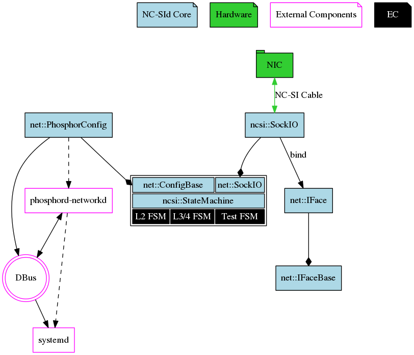
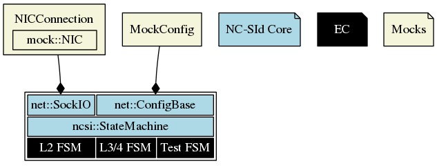

# NC-SId Internals

**NOTE**: This documents describes the internal architecture of NC-SId daemon.
However, it is meant to be used as a guide for understanding the code, not on
its own. Some details are intentionally omitted.

In the diagram above the components are split into four groups:

- **NC-SId Core**. These are new components implemented in NC-SId.

- **Hardware**. External hardware components, in this case, the NIC.

- **EC**. This is the code borrowed from EC. The three state machines are pretty
  much copied from EC code.

- **External Components**. These are external services/daemons NC-SIs interacts
  with.

Let's look into their details.

## NIC

In the NIC — NC-SId interactions, NIC acts as a server, replying to NC-SId
requests and NC-SId itself acts as a client, sending those requests. Thus, there
is no state in NIC (server), but there is a state in NC-SId (client).

## EC State Machines

NC-SId reuses the state machines from EC. They are treated like black boxes.
They are C functions with simple interface: the state machine is given incoming
NC-SI command buffer (reply from the NIC) and returns the buffer that needs to
be sent to the NIC (the next command).

### L2 FSM

This state machine performs basic configuration of the NC-SI comm channel and
also reads the MAC Address of the NIC.

### L3/4 FSM

Once BMC's network is configured, this state machine sets up filters in the NIC.

### Test FSM

This state machine periodically tests NC-SI connection with the NIC, verifies
filters and queries the NIC state (hostless or host-based). If it ever fails,
all state machines restart, which means that NC-SI in the NIC is also reset and
reconfigured.

---

In addition to the buffer there are parameters that provide information which is
not a part of EC state machines' state:

- State Parameters. These structures are allocated outside of EC State Machines,
  but their content is fully managed by EC State Machines.
- MAC Address. For L2 FSM this parameter is _OUT_.
- IP Address (only for L3/4 FSM and Test FSM) for setting up and verifying
  filteres. If set to zero, the NIC filter won't check for IP address.
- TCP Port (only for L3/4 FSM and Test FSM) for setting up and verifying
  filters.

In the initial state the command buffer (reply from the NIC) is empty. When
there is nothing more to send to the NIC, i.e. that particular state machine is
done, it returns empty buffer.

## External Components

NC-SId uses `phosphord-networkd` to configure the BMC's network (MAC Address).
In turn, `phosphord-networkd` uses `systemd`. Their interactions go through
`DBus`.

## NC-SId Core

### ncsi::StateMachine

This component coordinates the interaction between EC State Machines and is also
heavily based on EC code. It uses `net::SockIO` interface to interact with the
NIC and `net::ConfigBase` interface to set/query MAC Address.

### net::PhosphorConfig

Implements `net::ConfigBase` and makes calls to `phosphord-networkd` via `DBus`
to get/set MAC Address.

### ncsi::SockIO

Implements `net::SockIO` and sends NC-SI commands to the NIC through raw Unix
socket. That socket is configured using `net::IFace` component, which represents
the network interface (think ethX). To simplify testing, the abstract
`net::IFaceBase` interface is introduced.

---

## Unit Testing

To allow some fairly sophisticated unit-tests, EC State Machines as well as
`ncsi::StateMachine` component only interact with the outside world using
`net::SockIO` and `net::ConfigBase` interfaces. This makes it easy to mock them.

The most complicated part of these tests is `mock::NIC`, which acts as a NC-SI
server, replying to NC-SI requests coming from NC-SI State Machines.
